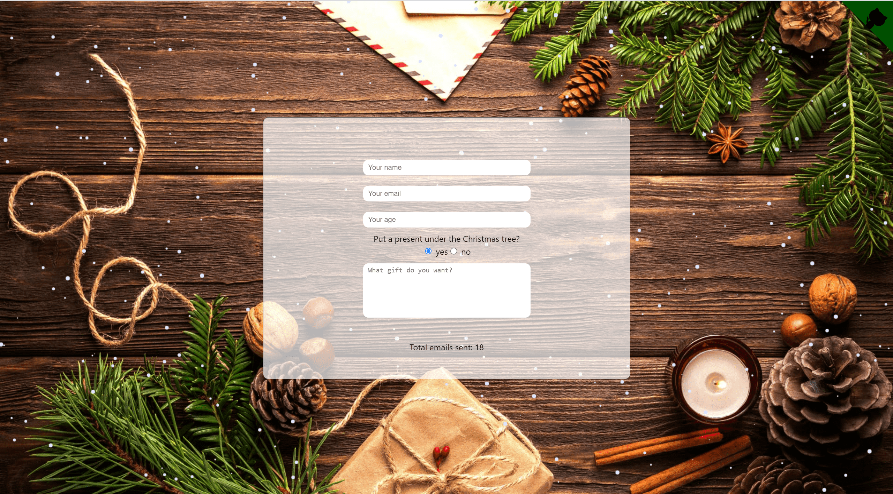

# Letter for Santa
___

## Description

With this application you can send a letter to Santa Claus together with your children. 
I decided to learn the basics of the backend and databases on my own. 
To understand the principle of interaction with the frontend.  
Demo:   

Application functionality:  
+ Backend basics  
+ Getting information from the database  

___

### :briefcase: language and tools

 
 

The following libraries are installed in this project:

- **axios**

- **formik**

- **gh-pages**

- **jest**

- **react** and **@types/react**

- **react-dom** and **@types/react-dom**

- **react-redux** and **@types/react-redux**

- **react-router-dom** and **@types/react-router-dom**

- **react-scripts**

- **redux** and **@reduxjs/toolkit"**

- **redux-thunk**

- **typescript**

- **sass**

## How to start a project

After git clone 'link' install all dependencies from package.json:

### `yarn`

and then run the project:

### `yarn start`